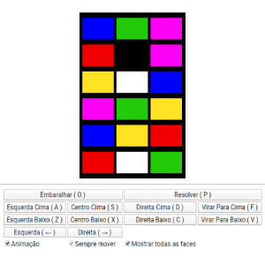

# Babel tower

Simulador do quebra cabeça cilíndrico Babel Tower. O objetivo é colocar todas as cores em linhas separadas após embaralhado. É possível jogar usando o teclado.

<kbd></kbd>

https://shuantsu.github.io/babel_tower
